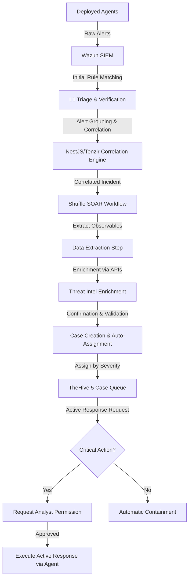

# CySA Atlas — Full Infrastructure Context Prompt
*Last verified: 2026-07-11 18:50 UTC — Live diagnostics run on Azure VM*

You are an AI assistant helping build **CySA Atlas**, a full-stack open-source Security Operations Center (SOC) platform. Below is the complete picture of what we are building, the current verified state, the architecture, and all technical details. Use this as your ground truth for every decision.

---

## WHAT WE ARE BUILDING

CySA Atlas is a custom SOC platform consisting of:
- A **SIEM** (Security Information and Event Management) layer — Wazuh
- A **SOAR** (Security Orchestration, Automation and Response) layer — Shuffle
- **Case Management** (incident tracking) — TheHive 5
- A **custom web platform** (Next.js frontend + NestJS backend) that consumes all services via REST APIs and presents a unified SOC dashboard

> **KEY DECISION**: The custom Next.js + NestJS platform runs on the **developer's local machine**, NOT on the Azure VM. The Azure VM only hosts the backend SOC services (Wazuh, Shuffle, TheHive). The Wazuh Dashboard is NOT needed — our custom frontend replaces it.

The platform is designed for a CySA+ (CompTIA Cybersecurity Analyst) training and real-world SOC simulation environment.

---

## INFRASTRUCTURE OVERVIEW

### Cloud: Microsoft Azure VM
- **OS:** Ubuntu 24.04 LTS
- **Architecture:** AMD x86_64
- **RAM:** 16GB (8.7GB used, 6.9GB available)
- **Disk:** 123GB total, 35GB used, 89GB free
- **User:** azureuser
- **Public IP:** 20.91.141.211
- **Internal IP:** 10.0.0.4
- **Docker Mode:** Swarm (single-node manager) + Compose

### Local Machine (Developer)
- Runs the Next.js frontend (:3005) and NestJS backend (:4000)
- Connects to Azure cloud services via public IP
- Uses Docker Compose for local platform stack

---

## ACTUAL DIRECTORY STRUCTURE ON AZURE (VERIFIED)

> **CRITICAL**: Two directories exist. The Git repo is the source of truth.

```
/opt/
├── CySA-config/              ← GIT REPO (github: Youness-Tr/CySA-config) — SOURCE OF TRUTH
│   ├── AGENT_CONTEXT.md      ← This file
│   ├── .gitignore
│   ├── proxy/
│   │   └── nginx.conf        ← Nginx reverse proxy config
│   ├── thehive/
│   │   ├── cassandra/        ← Cassandra data (bind mount — GITIGNORED)
│   │   └── minio/            ← MinIO data (bind mount — GITIGNORED)
│   └── wazuh-docker/
│       └── single-node/
│           └── config/
│               └── wazuh_indexer_ssl_certs/   ← TLS certs (all 9 present)
│
├── cysa/                     ← RUNTIME working dirs (docker-compose projects run here)
│   ├── proxy/nginx.conf      ← copy of above
│   ├── thehive/
│   │   ├── cassandra/        ← same bind mount data
│   │   └── minio/            ← same bind mount data
│   └── wazuh-docker/single-node/config/wazuh_indexer_ssl_certs/
│
└── cysa-config/              ← LEGACY duplicate (same structure, can be removed)
```

> **TODO**: docker-compose.yml files are NOT on disk anywhere. All containers are running
> from Docker's internal state (started previously). Need to recreate and commit them.

---

## SERVICE 1: WAZUH (SIEM) — Full Docker Stack

### Version: 4.14.5
### Compose project: `single-node` — was started from `/opt/cysa/wazuh-docker/single-node/`
### Status: PARTIAL — Manager + Indexer UP, Dashboard MISSING

### Containers (VERIFIED 2026-07-11):
```
single-node-wazuh.manager-1  → wazuh/wazuh-manager:4.14.5   ✅ Up (2h)
single-node-wazuh.indexer-1  → wazuh/wazuh-indexer:4.14.5   ✅ Up (2h), cluster GREEN
wazuh.dashboard              → NOT RUNNING ❌ (needs to be added back)
```

### Ports:
```
:1514  → Wazuh agent log ingestion (TCP/UDP)  ← NOTE: Tenzir also uses :1514, CONFLICT CHECK NEEDED
:1515  → Wazuh agent enrollment/registration
:514   → Syslog (UDP)
:55000 → Wazuh Manager REST API (HTTPS + JWT auth)  ✅ WORKING
:9200  → Wazuh Indexer (OpenSearch, HTTPS + basic auth)  ✅ WORKING
:443   → Wazuh Dashboard — NOT NEEDED (custom frontend replaces it)
```

### HTTP Proxy (cysa-proxy container):
```
:9201  → proxies HTTPS :9200 as plain HTTP (strips TLS, injects auth header)
:55001 → proxies HTTPS :55000 as plain HTTP
```
The proxy is an Nginx container using `/opt/cysa/proxy/nginx.conf`

### Credentials:
```
Wazuh API:
  Username: wazuh-wui
  Password: MyS3cr37P450r.*-
  Auth: POST /security/user/authenticate (JWT, expires 15min, cache 14min)

OpenSearch/Indexer:
  Username: admin
  Password: SecretPassword

Dashboard:
  Username: admin (or kibanaserver)
  Password: (TBD — dashboard not running)
```

### TLS Certificates (stored in wazuh_indexer_ssl_certs/):
```
admin-key.pem, admin.pem
root-ca-manager.key, root-ca-manager.pem
root-ca.key, root-ca.pem
wazuh.dashboard-key.pem, wazuh.dashboard.pem    ← dashboard certs EXIST
wazuh.indexer-key.pem, wazuh.indexer.pem
(wazuh.manager.pem MISSING from repo — in volume only)
```

### OpenSearch Indices (VERIFIED):
```
wazuh-alerts-4.x-*                          → 194 alerts total ✅ (self-monitoring only)
wazuh-states-vulnerabilities-wazuh.manager  → 0 docs ❌ (vuln scanner not configured)
wazuh-states-inventory-*/wazuh.manager      → 0 docs (no agents)
```

### Current ossec.conf state (VERIFIED):
```xml
<syscheck>         → EMPTY (FIM NOT configured) ❌
<vulnerability-detection> → EMPTY (vuln scanner NOT configured) ❌
<wodle name="syscollector"> → present but minimal
<wodle name="osquery">      → present but empty
```

### Wazuh Agents (VERIFIED):
```
Agent 000: wazuh.manager (built-in self) — status: active
NO real agents enrolled ❌
```

---

## SERVICE 2: SHUFFLE (SOAR)

### Compose project: `shuffle` — started from `/opt/cysa/shuffle/` (compose file MISSING from disk)
### Status: FULLY WORKING ✅

### Containers (VERIFIED):
```
shuffle-backend   → frikky/shuffle-backend:latest    ✅ Up (2h), :3001→5001
shuffle-frontend  → frikky/shuffle-frontend:latest   ✅ Up (2h), :3002→80
shuffle-orborus   → ghcr.io/shuffle/shuffle-orborus  ✅ Up (2h)
shuffle-database  → opensearchproject/opensearch:2.11.0  ✅ Up (9200 internal)
```

### Docker Swarm Services (Shuffle Apps):
```
shuffle-workers     1/1 replica  :33333  ghcr.io/shuffle/shuffle-worker:latest
shuffle-subflow_1-1-0  2/2 replicas  :33334
shuffle-tools_1-2-0    2/2 replicas  :33335
shuffle-ai_1-1-0       2/2 replicas  :33336
email_1-3-0            2/2 replicas  :33337
http_1-4-0             2/2 replicas  :33338
```

### Credentials (VERIFIED 2026-07-11):
```
Shuffle UI:       http://20.91.141.211:3002
Shuffle Backend:  http://20.91.141.211:3001
Admin username:   admin@cysa.local
Admin user ID:    6db5b1f4-e533-4612-bb25-cbd7afa5ba1f
API Key:          b2f9fca5-16ca-4e66-a03e-bc80f59f05c4   ← VERIFIED from OpenSearch DB
Org ID:           7703d9c5-fed2-44aa-ab8f-ec197d52c79d
```

### Webhook (Wazuh → Shuffle):
```
Webhook ID:  b76d3576-f033-47a3-8731-e8ad8aa62942
Webhook URL: http://20.91.141.211:3002/api/v1/hooks/webhook_b76d3576-f033-47a3-8731-e8ad8aa62942
Status:      running ✅  (frontend proxies to backend correctly)
In ossec.conf: ✅ ALREADY CONFIGURED — Wazuh sends all level>=3 alerts here
```

### Workflow Status (VERIFIED):
```
Workflow [40642101-1eea-4b86-b1b7-f88404f3b5d5]:
  Name: CySA Atlas - SOAR Sync Test
  Status: test (stub)
  Trigger: Webhook b76d3576 → running ✅ (receives Wazuh alerts)
  Action: HTTP POST → https://office-finger-issue-incl.trycloudflare.com  ← STALE CLOUDFLARE TUNNEL
  Executions: 16 total, recent ones FINISHED
  
NEEDS FIX:
  - The POST action URL must point to NestJS backend /api/v1/soar/sync
  - Need to add proper alert routing logic (vulnerability/FIM/network classification)
  - Need to add TheHive case creation action
```

---

## SERVICE 3: THEHIVE (Case Management)

### Compose project: `thehive` — started from `/opt/cysa/thehive/` (compose file MISSING from disk)
### Status: FULLY WORKING ✅

### Containers (VERIFIED):
```
thehive           → strangebee/thehive:5    ✅ Up (2h), :9003→9000
thehive-cassandra → cassandra:4.1           ✅ Up (2h, healthy)
thehive-minio     → minio/minio             ✅ Up (2h, healthy), :9000-9001
thehive-minio-init → minio/mc              ✅ Exited (0) — bucket created
```

### Credentials (VERIFIED):
```
TheHive login:
  URL: http://20.91.141.211:9003
  Username: admin@thehive.local
  Password: secret
  Login: ✅ VERIFIED working

TheHive API Key: 5icIawuRoHIgT52C87umiCZ8gidV8lZf   ← GENERATED 2026-07-11
  (renew via: POST /api/v0/user/admin@thehive.local/key/renew with basic auth)

MinIO:
  Console: http://20.91.141.211:9001
  Access key: admin
  Secret key: adminadmin
  Bucket: thehive ✅ (created by minio-init)
```

### TheHive application.conf (target: /opt/cysa/thehive/application.conf — currently MISSING):
```hocon
play.http.secret.key="a477be6f719deb7801c2a45f3715f146244d30ea1585a7a91e26822f3f2b905c"
db.janusgraph {
  storage.backend = cql
  storage.hostname = ["thehive-cassandra"]
  storage.cql.keyspace = thehive
  storage.cql.read-consistency-level = ONE
  storage.cql.write-consistency-level = ONE
}
storage {
  provider = s3
  s3 {
    bucket = "thehive"
    endpoint = "http://thehive-minio:9000"
    accessKey = "admin"
    secretKey = "adminadmin"
    region = "us-east-1"
    pathStyleAccess = true
  }
}
```

### TheHive Data State:
```
License: Platinum Trial (15 days from boot)
Cases: 0 (no cases yet)
```

---

## TENZIR (Unplanned — running)

### Status: Running (not in original plan)
```
tenzir-node → tenzir/tenzir:main  ✅ Up (2h)
  Port :1514 → ⚠️ SAME PORT as Wazuh agent ingestion — CHECK FOR CONFLICT
  Port :5160
```
**Action needed**: Determine if Tenzir is intentional and resolve port :1514 conflict.

---

## LOCAL PLATFORM STACK

### Location: CySA-Atlas/ (Git repo — on developer machine)
### Status: NOT YET TESTED against Azure (NestJS .env not filled in)

### Backend .env values (COMPLETE — use these):
```dotenv
PORT=4000
WAZUH_API_BASE_URL=https://20.91.141.211:55000
WAZUH_API_USERNAME=wazuh-wui
WAZUH_API_PASSWORD=MyS3cr37P450r.*-
WAZUH_INDEXER_BASE_URL=https://20.91.141.211:9200
WAZUH_INDEXER_USERNAME=admin
WAZUH_INDEXER_PASSWORD=SecretPassword
THEHIVE_URL=http://20.91.141.211:9003
THEHIVE_API_KEY=5icIawuRoHIgT52C87umiCZ8gidV8lZf
SHUFFLE_URL=http://20.91.141.211:3001
SHUFFLE_API_KEY=b2f9fca5-16ca-4e66-a03e-bc80f59f05c4
DB_HOST=platform-db
DB_PORT=5432
DB_USERNAME=postgres
DB_PASSWORD=postgres
DB_NAME=platform
```

### IMPORTANT — TLS on Azure:
- Wazuh Indexer uses HTTPS with self-signed certs
- NestJS must use `httpsAgent({ rejectUnauthorized: false })` for ALL Wazuh calls
- OR use the proxy ports: :9201 (indexer HTTP) and :55001 (API HTTP) — no TLS needed

### NestJS backend is on DEVELOPER'S LOCAL MACHINE, not on Azure VM.
- Azure VM does NOT run the NestJS backend (:4000 is NOT open on Azure)
- The Shuffle workflow POST action must point to wherever NestJS is reachable from Azure
  (use ngrok / cloudflare tunnel / or deploy NestJS to Azure when ready)

---

## NESTJS BACKEND — API ENDPOINTS

### Authentication pattern:
- Wazuh: POST /security/user/authenticate → JWT token (cached 14min)
- TheHive: Bearer API key in Authorization header
- Shuffle: Bearer API key in Authorization header
- OpenSearch: Basic auth (admin:SecretPassword) or use proxy

### Modules and endpoints:
```
WAZUH MODULE (/api/v1/wazuh/)
  GET  /agents-status          → active/disconnected/pending/total counts
  GET  /agents-list            → all agents: id, name, ip, status, os, lastKeepAlive
  GET  /security-alerts        → last 50 alerts level>=3, sorted desc
  GET  /vulnerability-summary  → CVE summary per agent

FIM MODULE (/api/v1/fim/)
  Queries: OpenSearch wazuh-alerts-* filter: rule.groups=syscheck
  GET  /alerts    → last 50 FIM events
  GET  /summary   → aggregated stats

VULNERABILITY MODULE (/api/v1/wazuh/vulnerabilities/)
  Queries: OpenSearch wazuh-states-vulnerabilities-*
  GET  /           → all CVEs sorted by CVSS desc
  GET  /summary    → by severity, by agent, avg CVSS
  GET  /:agentId   → CVEs for specific agent

NETWORK MODULE (/api/v1/network/)
  Queries: OpenSearch wazuh-alerts-* filter: data.suricata.*
  NOTE: requires Suricata on agents (not configured)

SOAR MODULE (/api/v1/soar/)
  POST /event    → save SOAR event (called by Shuffle)
  POST /sync     → alias for /event
  GET  /events   → all SOAR events sorted by timestamp desc
```

---

## NETWORK / FIREWALL

### Azure Public IP: 20.91.141.211
### Azure NSG Inbound rules needed:
```
Port 22     TCP → SSH
Port 443    TCP → Wazuh Dashboard (❌ container down)
Port 1514   TCP/UDP → Wazuh agents (⚠️ Tenzir conflict check)
Port 1515   TCP → Wazuh enrollment
Port 514    UDP → Syslog
Port 55000  TCP → Wazuh API ✅
Port 9200   TCP → Wazuh Indexer ✅
Port 3001   TCP → Shuffle Backend ✅
Port 3002   TCP → Shuffle Frontend ✅
Port 9003   TCP → TheHive ✅
Port 9000   TCP → MinIO S3 ✅
Port 9001   TCP → MinIO Console ✅
```

### Docker Networks:
```
shuffle_shuffle_network   → bridge, Shuffle + TheHive + Tenzir
single-node_default       → bridge, Wazuh manager + indexer
tenzir-network            → bridge, Tenzir
bridge                    → default (proxy)
ingress                   → swarm overlay (shuffle apps)
shuffle_swarm_executions  → swarm overlay (shuffle workers)
```

---

## GIT REPOSITORIES

### Repo 1: CySA-Atlas (GitHub)
- Contains: local platform (frontend + backend + docker-compose)
- Branch: main — on developer machine

### Repo 2: CySA-config (GitHub: Youness-Tr/CySA-config)
- Location on server: /opt/CySA-config/
- Commits: 1 commit ("Initial CySA infrastructure")
- **CRITICAL GAP**: docker-compose.yml files not yet committed ❌

---

## MASTER ROADMAP

### 🔴 PHASE 1 — SOAR Pipeline (CURRENT PRIORITY)
*Wazuh → Shuffle → TheHive full automation*

- [ ] 1.1 Fix Shuffle workflow: replace stale Cloudflare URL with NestJS backend URL
- [ ] 1.2 Add alert classification logic in Shuffle (vulnerability / FIM / network_attack)
- [ ] 1.3 Add TheHive case creation action in Shuffle workflow
- [ ] 1.4 Commit ossec.conf + local_rules.xml to CySA-config git repo
- [ ] 1.5 Test end-to-end: trigger alert → Shuffle runs → TheHive case created

### 🟡 PHASE 2 — SIEM Data Enrichment
*Get real data flowing (no agents needed for server-level monitoring)*

- [ ] 2.1 Harden ossec.conf: add more FIM paths, tune alert levels
- [ ] 2.2 Add meaningful custom rules in local_rules.xml
- [ ] 2.3 Enroll first Wazuh agent (Azure VM itself or a test endpoint)
- [ ] 2.4 Verify FIM + CVE alerts flowing into OpenSearch

### 🟢 PHASE 3 — NestJS Backend Integration
*Wire local backend to all Azure services*

- [ ] 3.1 Set NestJS backend .env with all Azure credentials (values are KNOWN — see above)
- [ ] 3.2 Implement httpsAgent (rejectUnauthorized: false) for all Wazuh calls
- [ ] 3.3 Test all /api/v1/* endpoints: wazuh, fim, vulnerability, soar
- [ ] 3.4 Update Shuffle workflow POST URL to point to local NestJS (via tunnel or deploy)

### 🟢 PHASE 4 — Next.js Frontend
*Build the unified SOC Dashboard UI*

- [ ] 4.1 Connect Next.js to NestJS API
- [ ] 4.2 Build Agents Status panel
- [ ] 4.3 Build Security Alerts panel
- [ ] 4.4 Build FIM / Vulnerability panels
- [ ] 4.5 Build SOAR Events panel
- [ ] 4.6 Build TheHive Cases panel

### 🔵 PHASE 5 — Advanced Modules (Future)
- MISP (Threat Intel) → :443
- OpenCTI (ATT&CK) → :8080
- Sigma + Jupyter (Threat Hunting) → :8888
- Python ML UEBA (scikit-learn, Isolation Forest)
- Velociraptor (Digital Forensics) → :8889
- CAPE Sandbox (Malware) → :8000
- Resolve Tenzir port :1514 conflict with Wazuh agents (when agents are deployed)

---

## CURRENT STATUS (VERIFIED 2026-07-13 14:00 UTC)

### ✅ WORKING:
- Wazuh Manager + Indexer (4.14.5) — API auth ✅, OpenSearch GREEN ✅ (Security plugin initialized and fully authenticated)
- Wazuh ossec.conf — FIM (syscheck) ✅ enabled, Vuln Detection ✅ enabled, Shuffle integration ✅ configured
- Wazuh → Shuffle webhook — ✅ LIVE (Wazuh sends level>=3 alerts to Shuffle webhook)
- Shuffle full stack — backend ✅, frontend ✅, orborus ✅, 6 swarm app services ✅
- Shuffle webhook (b76d3576) — ✅ running, receives alerts, triggers workflow
- Shuffle API key — ✅ b2f9fca5-16ca-4e66-a03e-bc80f59f05c4
- TheHive + Cassandra + MinIO — ✅ login works, SOC org created, integration user API key: 5WPuhetgYO5E0wp1mc6aAc0S44n4uAuZ
- Cysa-proxy Nginx — ✅ :9201 (indexer HTTP) and :55001 (API HTTP) (auto-injecting correct basic auth header)
- Docker Swarm — ✅ single-node manager active
- Shuffle SOAR Pipeline — ✅ FULLY OPERATIONAL. Webhook triggers → NestJS POST `/api/v1/soar/sync` (returns 201) → TheHive Alert `/api/v1/alert` (returns 201) → Promote Alert to Case `/api/v1/alert/{id}/case` (returns 201).
- TheHive Webhook — ✅ CONFIGURED. Forwarding Case/Alert events internally to Shuffle endpoint (`a15dc028-1897-40a3-af76-9ce8290c9d15`).


### ❌ BROKEN / NEEDS FIX:
- Wazuh agents — ⏳ DEFERRED (intentional — no agents enrolled yet)
- NestJS backend .env — needs filling in on developer machine (values known, see above)
- Tenzir port :1514 — ⏳ DEFERRED (check conflict when agents deployed)

### 🎯 IMMEDIATE NEXT TASK:
1. Verify the local NestJS backend successfully receives and registers the synchronized SOAR events.
2. Prepare to enroll the first Wazuh agent on the Azure VM or test endpoint (Phase 2).
3. Test end-to-end alert pipeline from an actual agent event.

---

## KEY ARCHITECTURAL DECISIONS & LESSONS LEARNED

1. **ARM→AMD migration**: Moved from Oracle Cloud ARM64 to Azure AMD x86_64.
   AMD: all official images work, no workarounds needed.

2. **Two git repos**: CySA-Atlas (platform code) + CySA-config (server configs).
   Config as code: always edit locally → git push → deploy.sh.

3. **TLS everywhere in Wazuh**: All Wazuh services use HTTPS mutual TLS.
   NestJS must use `httpsAgent({rejectUnauthorized:false})` for all calls,
   OR use cysa-proxy ports (:9201 for indexer, :55001 for API) which strip TLS.

4. **Shuffle internal port**: Backend runs on :5001 internally. Docker maps :3001→:5001.

5. **TheHive startup order**: cassandra healthy → minio healthy → minio-init done → thehive.
   Use healthchecks + depends_on with condition: service_healthy.

6. **TheHive storage**: Uses s3/MinIO. MinIO bucket must exist before TheHive starts.

7. **JWT caching**: Wazuh JWT tokens expire 15min. Cache for 14min in NestJS.

8. **Docker Swarm**: Shuffle uses Docker Swarm mode for app worker scaling.
   Both Compose services and Swarm services coexist on this node.

9. **OpenSearch dual use**:
   - Wazuh Indexer (port :9200) → HTTPS + auth, stores security events
   - Shuffle Database (internal) → HTTP, no auth, stores workflows
   These are TWO SEPARATE instances — never mix them.

10. **Proxy design**: cysa-proxy (Nginx) strips TLS from Wazuh services.
    :9201 = Wazuh Indexer (plain HTTP), :55001 = Wazuh API (plain HTTP).

---

## SOC ARCHITECTURE & 3-TIER ANALYST WORKFLOW

This section details the custom analyst workflow, unified interface architecture, and case context requirements for CySA Atlas.

### 1. The Core Alert & Triage Pipeline



* **Alert Correlation**: Before passing alerts to the SOAR pipeline, alerts are correlated (grouped by event types, source IPs, and patterns) in NestJS/Tenzir to ensure analysts deal with unified incidents rather than repetitive alerts.
* **Extraction & Enrichment**: Shuffle automatically extracts indicators (IPs, domains, hashes) from the correlated event, queries enrichment APIs (AbuseIPDB, VirusTotal, MISP), and logs results.
* **Case Creation & Assignment**: Cases are automatically created in TheHive under the SOC organisation. The case is assigned to an analyst based on severity:
  * **Low/Medium**: Assigned to Tier 1 / Tier 2 analysts.
  * **High/Critical**: Assigned to Tier 3 analysts.

### 2. Interactive Response & Permission Gate
* When the SOAR pipeline triggers a **critical containment action** (e.g. blocking an IP, terminating a process, or isolating an endpoint), it must not execute silently.
* Shuffle initiates a **User Approval** step, sending a webhook to the NestJS backend.
* The NestJS backend displays a prompt to the analyst assigned to the case.
* Once the analyst clicks **Approve** in the CySA platform UI, NestJS sends a callback to Shuffle to resume the workflow and trigger the Wazuh active response on the target agent.

### 3. Single-Pane-of-Glass & Case Context
* **No Direct UI Access**: Analysts do not log into the individual backends (Wazuh, Shuffle, TheHive). All operations, logs, playbooks, and cases are accessed exclusively through the custom Next.js + NestJS UI on the developer machine.
* **Case Context**: When an analyst selects a case, the platform enters the **Case Context**. Under this context:
  * The **Threat Hunting panel (Tenzir)** automatically restricts searches to logs matching the case observables.
  * The **Malware Sandbox panel** only shows files submitted for that case.
  * The **UEBA panel** displays behavior profiles of users/devices involved in the case.
  * This creates a seamless, focused workspace where the UI adapts entirely to the active investigation.
